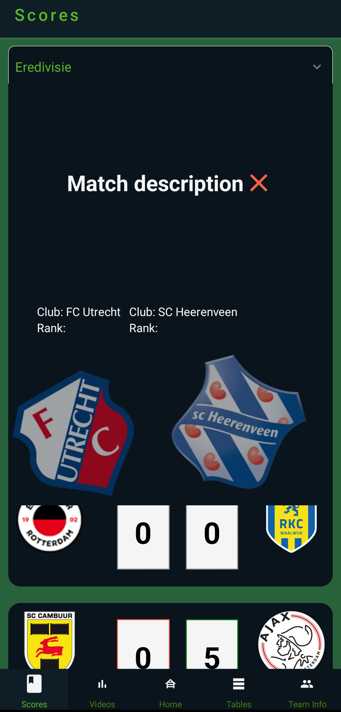
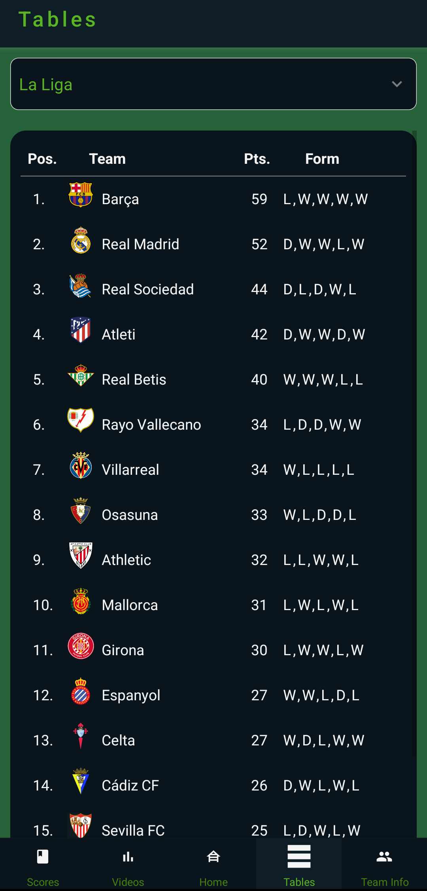
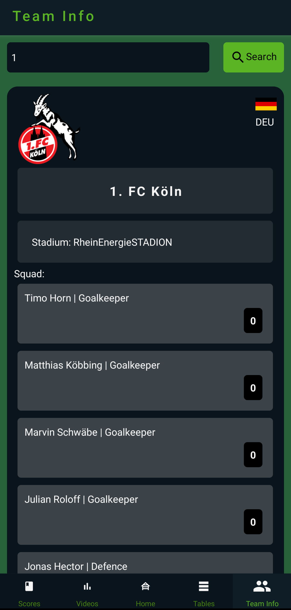
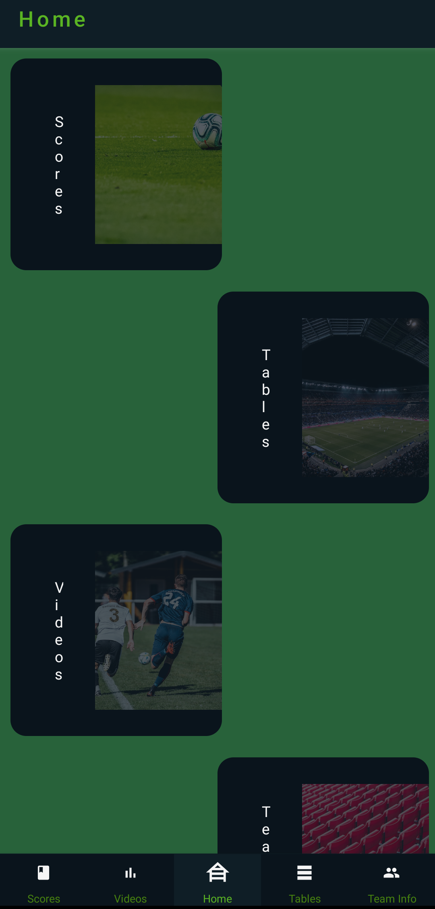
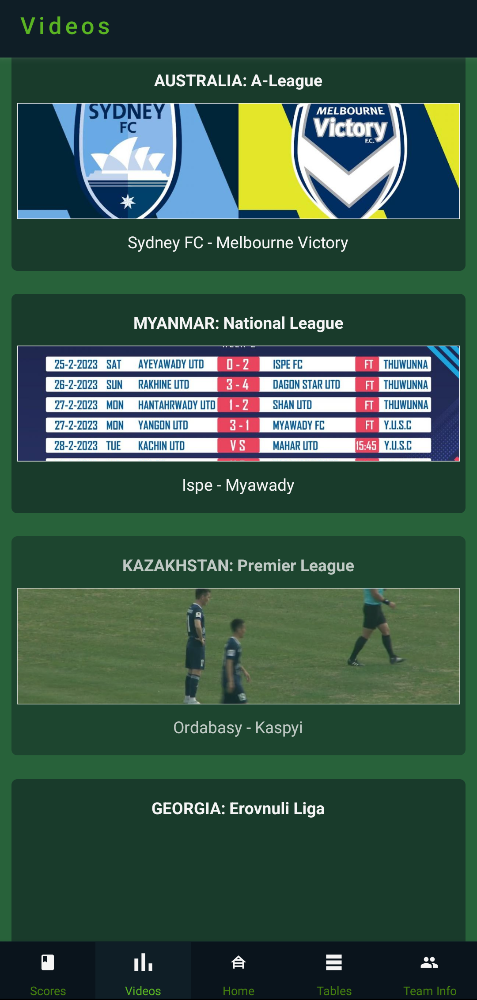
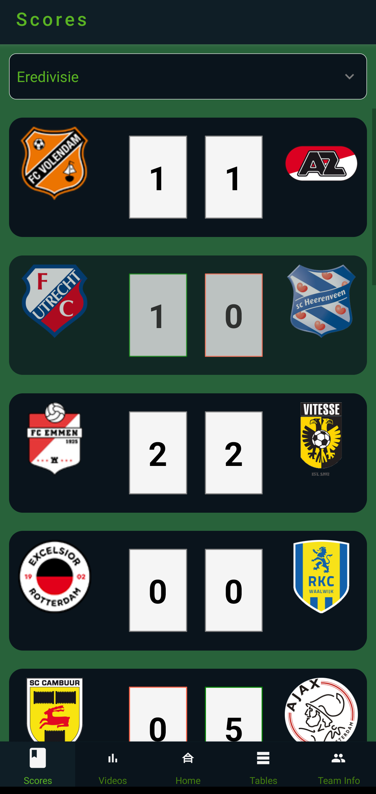

# Socceroz

## Table of contents
- [General info](#general-info)
- [Technologies](#technologies)
- [Screenshots](#screenshots)

## General info
This is my first more complex React Native app however I don't consider it a fully fledged solution. This app was more of a playground for new things I learned in the process like zod or react-query. In order to run it you will have to set 2 env variables (both are API keys).
## Technologies
- React Native (Expo)
- React Query
- Zod
## Screenshots

App powered by this two excellent APIs:
- [Football data](https://www.football-data.org/)
- [Scorebat](https://www.scorebat.com/)
